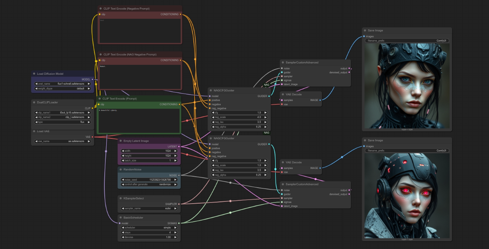

# ComfyUI-NAG

Implementation of [Normalized Attention Guidance: Universal Negative Guidance for Diffusion Models](https://chendaryen.github.io/NAG.github.io/) for [ComfyUI](https://github.com/comfyanonymous/ComfyUI).

NAG restores effective negative prompting in few-step diffusion models, and complements CFG in multi-step sampling for improved quality and control.

Paper: https://arxiv.org/abs/2505.21179

Code: https://github.com/ChenDarYen/Normalized-Attention-Guidance

Wan2.1 Demo: https://huggingface.co/spaces/ChenDY/NAG_wan2-1-fast

LTX Video Demo: https://huggingface.co/spaces/ChenDY/NAG_ltx-video-distilled

Flux-Dev Demo: https://huggingface.co/spaces/ChenDY/NAG_FLUX.1-dev

## News

2025-06-28: Flux Kontext is supported!

2025-06-26: Hunyuan video is now supported!

2025-06-25: Wan video generation is now supported (GGUF compatible)! Try it out with the new [workflow](https://github.com/ChenDarYen/ComfyUI-NAG/blob/main/workflows/NAG-Wan-Fast-ComfyUI-Workflow.json)!

## Nodes

- `NAGCFGGuider`
- `KSamplerWithNAG`

## Usage

To use NAG, simply replace the `CFGGuider` node with `NAGCFGGuider`, or the `KSampler` node with `KSamplerWithNAG` in your workflow.

We currently support `Flux`, `Wan`, `Vace Wan`, `Hunyuan Video`, `Choroma`, `SD3.5`, `SDXL` and `SD`.

Example workflows are available in the `./workflows` directory!

## Key Inputs

When working with a new model, it's recommended to first find a good combination of `nag_tau` and `nag_alpha`, which ensures that the negative guidance is effective without introducing artifacts.

Once you're satisfied, keep `nag_tau` and `nag_alpha` fixed and tune only `nag_scale` in most cases to control the strength of guidance.

- `nag_scale`: The scale for attention feature extrapolation. Higher values result in stronger negative guidance.
- `nag_tau`: The normalisation threshold. Higher values result in stronger negative guidance.
- `nag_alpha`: Blending factor between original and extrapolated attention. Higher values result in stronger negative guidance.

### Rule of Thumb

- For image-reference tasks (e.g., Image2Video), use lower `nag_tau` and `nag_alpha` to preserve the reference content more faithfully.
- For models that require more sampling steps and higher CFG, also prefer lower `nag_tau` and `nag_alpha`.
- For few-step models, you can use higher `nag_tau` and `nag_alpha` to have stronger negative guidance.
